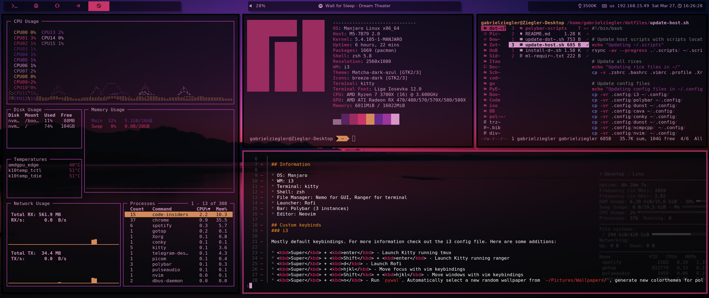

# Dotfiles

## Inspirations

Some snippets and configurations (specially, Polybar and PyWal config) were taken from [this repo](https://github.com/NicklasLallo/dotfiles).

## Information

* OS: Manjaro
* WM: i3
* Terminal: kitty
* Shell: zsh
* File Manager: Nemo for GUI, Ranger for terminal
* Launcher: Rofi
* Bar: Polybar (3 instances)
* Editor: Neovim

## Custom keybinds
### i3

Mostly default keybindings. For more information check out the i3 config file. Here are some additions:

* <kbd>Super</kbd> + <kbd>enter</kbd> - Launch Kitty running tmux
* <kbd>Super</kbd> + <kbd>Shift</kbd> + <kbd>enter</kbd> - Launch Kitty running ranger
* <kbd>Super</kbd> + <kbd>d</kbd> - Launch Rofi
* <kbd>Super</kbd> + <kbd>hjkl</kbd> - Move focus with vim keybindings
* <kbd>Super</kbd> + <kbd>Shift</kbd> + <kbd>hjkl</kbd> - Move windows with vim keybindings
* <kbd>Super</kbd> + <kbd>n</kbd> - Run `pywal`. Automatically select a new random wallpaper from `~/Pictures/Wallpapers/`, generate new colorthemes for polybar, kitty, i3, rofi, and automatically tell those applications to update (polybar restarts quietly). This is also done on each restart.

### Demo

### Full screen picture

